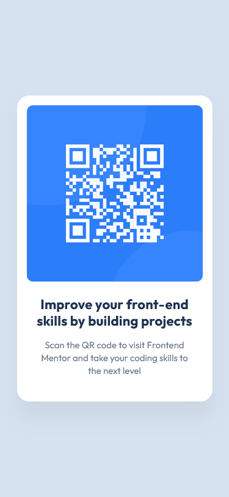
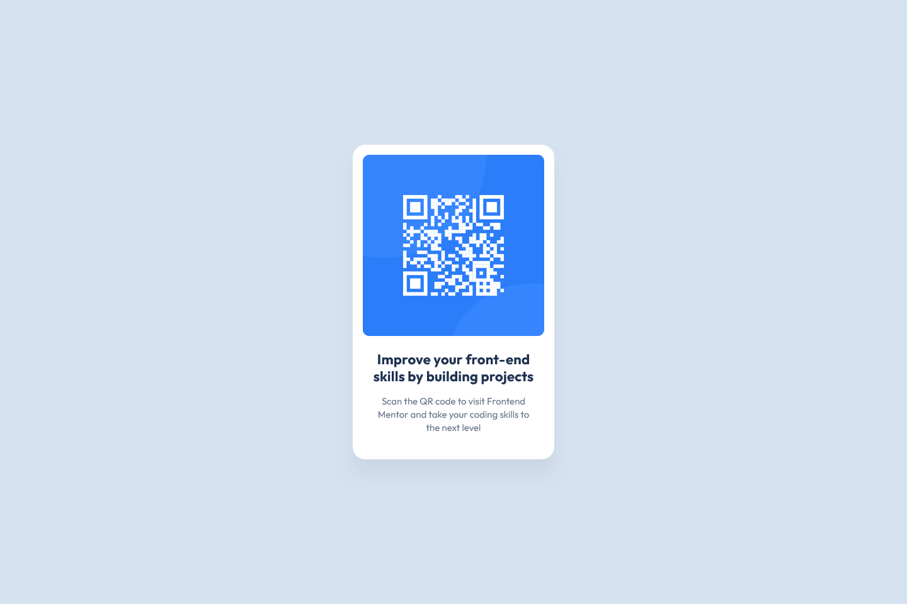

# Frontend Mentor - QR code component solution

This is a solution to the [QR code component challenge on Frontend Mentor](https://www.frontendmentor.io/challenges/qr-code-component-iux_sIO_H). Frontend Mentor challenges help you improve your coding skills by building realistic projects. 

## Table of contents

- [Overview](#overview)
  - [Screenshot](#screenshot)
  - [Links](#links)
- [My process](#my-process)
  - [Built with](#built-with)
  - [What I learned](#what-i-learned)
  - [Continued development](#continued-development)
  - [Useful resources](#useful-resources)
  - [AI Collaboration](#ai-collaboration)
- [Author](#author)

## Overview

### Screenshot

- Solution in mobile 📱:

- Solution in desktop 💻:

### Links

- [Frontend Mentor Solution](https://your-solution-url.com)
- [Live Site](https://juanbonilla.me/FEM_LP_qr-code-component/)

## My process

### Built with

- Semantic HTML5 markup
- CSS custom properties - for managing colors and spacing consistently
- CSS Grid - to center the card component
- CSS Reset - rules adapted from Josh Comeau's ["A Modern CSS Reset"](https://www.joshwcomeau.com/css/custom-css-reset/)

### What I learned

While this specific challenge was straightforward for me to complete, it served as an excellent opportunity to focus on writing clean and semantic HTML code. I prioritized clarity by implementing semantic HTML tags and reusable CSS styles that are easy to follow and modify in the future.

### Continued development

Moving forward into my next projects, I want to focus on a mix of expanding my technical toolkit and refining my foundational skills:

- **Micro-interactions and Animations**: While I focus on clean layout structure, I want to start incorporating subtle micro-interactions (like smooth hover effects, active states, and transition animations). This will help elevate my projects from static pages to more engaging, dynamic user experiences.

- **Deepening Accessibility**: Accessibility is a skill I am constantly looking to refine. I want to continue pushing myself in future projects to ensure my semantic HTML translates perfectly to screen readers and keyboard navigation.

- **The "AI Mentor" Workflow**: This project proved how valuable continuous, guided interaction is for my growth. I plan to keep using this conversational approach to uncover gaps in my understanding of the fundamentals. Creating a comfortable space to ask "silly" questions is something I want to maintain to ensure I am never building on shaky foundations.

### Useful resources

- [A Modern CSS Reset by Josh Comeau](https://www.joshwcomeau.com/css/custom-css-reset/) - This was essential for clearing out default browser styles before implementing my own layout. I adapted rules from this reset to ensure a consistent, predictable baseline across different browsers.
- [AGENTS.md](./AGENTS.md) - Reading this file gave me a clear framework on how to effectively interact with the AI agent. It helped me shift my mindset from treating AI as a "code generator" to treating it as a true mentor, someone to ask silly questions, challenge my assumptions, and encourage me to think critically rather than just handing over the solution.
- [MDN Web Docs](https://developer.mozilla.org/) - My absolute go-to for diving deeper into specific CSS properties. For this challenge, it was helpful to get more details on viewport heights, `box-shadow` values, and centering elements using `display: grid` and `place-items: center`.

### AI Collaboration

For this project, I collaborated initially with Cursor and once I reached the free tier limits, I decided to continue with Claude as I enjoyed the personalized coding mentor experience. I settle on using Claude as I heard good comments of its models and I was curious about the interaction with it.

- I asked questions, even the ones that felt "silly", and walk through my thought process.
- The realization that AI can act as a patient, always-available mentor was a complete game-changer. It created a safe space to ask fundamental questions, which dramatically reinforced my understanding and kept my momentum going.
- Since the coding challenge itself was relatively simple, it allowed me to focus purely on the conversational and conceptual side of learning.

## Author

- Website - [juanbonilla.me](https://juanbonilla.me)
- Frontend Mentor - [@juanpb96](https://www.frontendmentor.io/profile/juanpb96)
- [LinkedIn](https://www.linkedin.com/in/juanpablobonilla/)